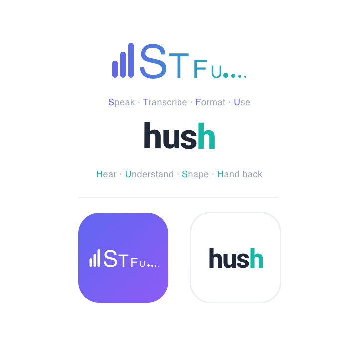

<div align="right">
  <a href="README_RU.md">🇷🇺 Русский</a> &nbsp;|&nbsp; <b>🇬🇧 English</b> &nbsp;|&nbsp; <a href="README_ES.md">🇪🇸 Español</a>
</div>

<div align="center">



<br>

**Speak. Release. Done.**

Voice input with LLM post-processing — local, no servers, no subscriptions.

<br>

[](https://www.apple.com/macos/)
[](https://python.org)
[](https://pyobjc.readthedocs.io)
[](LICENSE)

</div>

---

HUSH is for people who think faster than they type. Hold a hotkey, speak, release — your words land in whatever app you're working in. Optionally run them through an LLM and get back a polished letter, task list, or formatted note. Speech recognition runs entirely on-device via Apple Neural Engine — no telemetry, no cloud microphone.

## Why HUSH?

The idea came after discovering [Spokenly](https://spokenly.app). It showed that voice input with LLM post-processing is genuinely useful — not a gimmick. But I wanted something of my own: no paid restrictions, no cluttered interface, tailored to the workflows I actually use.

HUSH was built and refined in the field — I use it every day. Every detail comes from a real need, not a feature checklist. I hope it works just as well for you.

Everything is configurable: scenarios, providers, themes. No paid tiers — just open source.

---

## Table of Contents

- [How It Works](#how-it-works)
- [Modes](#modes)
- [Hotkeys](#hotkeys)
- [Scenarios](#scenarios)
- [Scenario Editor](#scenario-editor)
- [History](#history)
- [LLM Providers](#llm-providers)
- [Color Themes](#color-themes)
- [Installation](#installation)
- [API Keys](#api-keys)
- [Privacy](#privacy)
- [Architecture](#architecture)
- [Languages](#languages)
- [Support](#support)

---

## How It Works

HUSH is an accessory app — no Dock icon, just a menu bar item. Launch it once and forget about it. It's always ready to accept your voice in any application.

**Under the hood:**

- Audio is captured via `sounddevice` directly into RAM
- Recognition runs through NVIDIA Parakeet TDT 0.6B, compiled for CoreML / Apple Neural Engine (~400 MB, bundled)
- Text is optionally sent to an LLM (local Ollama or cloud-based Anthropic / OpenAI / GLM)
- The result is injected into the active application via Accessibility API — no clipboard, no flicker

The first launch compiles the CoreML model for your specific chip. This takes up to a minute and happens exactly once. All subsequent launches are instant.

---

## Modes

### Silent Mode — Right ⌥

The fastest way to dictate. No extra steps needed.

1. **Hold** Right ⌥ → a small floating indicator appears at the screen edge
2. **Speak** — the indicator shows recording is active
3. **Release** → the chunk is transcribed

To dictate in multiple passes:

- Hold and release several times → chunks **accumulate**
- After a **4-second pause** — LLM processing begins
- The indicator bars visualize the countdown: green → red
- **Enter** during the countdown → paste immediately without LLM
- **Hover** during processing → an interrupt button appears (paste raw transcript)

The indicator remembers its screen position across sessions. Drag it anywhere.

---

### Full Mode — ⇧⌥

For complex tasks: dictate in parts, choose a scenario, review before pasting.

1. **⇧⌥** → the main window opens (no recording starts immediately)
2. **Hold ⌥** → record a chunk → **release** → transcript appears as a block in the window
3. Repeat as many times as needed — blocks accumulate
4. Pick a scenario and tap its button — text goes to the LLM
5. **Shift+Enter** → paste the result into the previously active app, window closes

If a default full-mode scenario is set (★), it's applied automatically on Shift+Enter — no need to tap a scenario button manually.

---

### Expanded Mode — double-click the title bar

When you've dictated a lot and want to read, edit, or simply view the text comfortably — expand the main window.

- **Double-click** anywhere in the main window's title bar → window expands to 640×680
- Double-click again → returns to compact size

In expanded mode the auxiliary panels (settings, history, providers, editor) automatically gather into a 2×2 cluster next to the window as a side effect:

- Drag any panel in the cluster → **the whole cluster moves together**
- **🔄** in settings → reset the cluster to its default position
- **🎯** → show / hide all cluster panels

---

## Hotkeys

| Gesture | Action |
|---------|--------|
| Hold Right ⌥ | Start recording (silent mode) |
| Release Right ⌥ | Stop recording, transcribe |
| ⇧⌥ (Shift + Right Option) | Open / close full mode |
| ⌥ in full-mode window | Record next block |
| Enter during countdown | Force immediate paste, skip LLM |
| Shift+Enter (full mode) | Paste (applies default scenario if set) |
| ⌥ during LLM processing | Interrupt LLM, paste raw text |
| Double-click title bar | Expand / collapse main window |

---

## Scenarios

Scenarios are configurable LLM system prompts applied to the transcribed text. Each scenario is a button in the interface. The built-in ones are fully editable and you can create your own.

Configuration lives in `~/.config/hush/scenarios.json`.

### Built-in scenarios

| Name | What it does |
|------|-------------|
| **MAIN** | Smart formatter: detects the text type (prompt, task list, letter, note) and formats accordingly; removes filler words and false starts |
| **CLEAN** | Adds punctuation, capitalization, typographic quotes; strips filler words without changing meaning |
| **LETTER** | Formats the text as a business letter: salutation, structure, sign-off |
| **Tasks** | Converts a stream of thoughts into a Markdown checkbox task list |
| **MD** | Formats as Markdown with headers, lists, and code blocks |

> A scenario with no prompt pastes the raw transcript directly — handy as a quick-paste button.

### Scenario flags

- **`silent mode`** — assign this scenario as the default for silent mode (only one allowed)
- **`full default ★`** — assign this scenario as the default for full mode (only one allowed)

---

## Scenario Editor

Open: ⚙ Settings → click any scenario.

| Field | Description |
|-------|-------------|
| **Label** (RU / EN / ES) | Up to 6 characters — displayed on the scenario button |
| **Model** | Override the LLM for this specific scenario (empty = auto) |
| **Prompt** | System instruction; transcribed text is appended automatically |
| **Silent mode** | Assign this scenario as default for silent mode |
| **Full default ★** | Assign this scenario as default for full mode |

When switching between scenarios with unsaved changes, HUSH will ask: **Save / Discard**.

---

## History

The last **50 transcriptions** are saved automatically to `~/.config/hush/history.json`.

The history panel (🕐) has three tabs:

| Tab | Contents |
|-----|----------|
| **All** | All blocks in chronological order |
| **Sessions** | Grouped: multiple chunks from one session merged into one entry |
| **Blocks** | Individual chunks only |

**What you can do:**

- Click an entry → add it as a new block in the current full-mode session
- Checkboxes → multi-select
- Buttons for multi-selection: **Delete** / **Merge** / **Add** / **Replace**

The panel stays open after pasting — you can keep picking and combining entries.

---

## LLM Providers

Configure via: ⚙ → **[KEYS]**.

| Provider | Type | What you need |
|----------|------|---------------|
| **Ollama** | Local | [Ollama](https://ollama.ai) installed + a model pulled (`ollama pull <model>`) |
| **Anthropic** | Cloud | API key (`sk-ant-...`) |
| **OpenAI** | Cloud | API key |
| **GLM** | Cloud | Zhipu GLM-4 API key |

The current `[KEYS]` panel edits the built-in providers only: Ollama, Anthropic, OpenAI, and GLM.

If you want additional OpenAI-compatible endpoints, add them manually to `~/.config/hush/providers.json` using schema v2. HUSH can read those providers in scenario routing even though the built-in UI does not yet manage them directly.

### Selecting a model in a scenario

The model for each scenario is chosen in the scenario editor via two dropdowns:

1. **Provider** — select from configured and available providers
2. **Model** — the list auto-populates with models available from the selected provider

Provider labels are shown in the dropdown, but scenarios are stored internally as `provider_id:model_name`. If no model is selected, HUSH uses an auto strategy: tries Ollama first, falls back to Anthropic if unavailable.

### Configuration File

Provider settings are stored in `~/.config/hush/providers.json` (schema v2). See [`defaults/providers.example.json`](defaults/providers.example.json) for the complete configuration format.

**Important:** Never commit real API keys to version control. Use the example file as a template and replace placeholder keys with your actual keys.

---

## Color Themes

8 built-in themes, switchable from settings (⚙ → Theme). All open panels — settings, scenario editor, history — update instantly.

| Theme | Background | Accent |
|-------|-----------|--------|
| **emerald** | dark green | bright green |
| **ocean** | dark blue | cyan |
| **neon** | dark purple | magenta |
| **gold** | dark amber | yellow |
| **paper** | cream | dark green |
| **sky** | light blue | dark blue |
| **sand** | warm beige | brown |
| **arctic** | icy white | teal |

---

## Installation

### Requirements

- **macOS 13+** (Ventura or newer)
- **Python 3.14** — `brew install python@3.14`
- **Accessibility permission** — required for automatic text injection (requested on first launch)
- **Microphone permission** — requested on first launch

Optional, for LLM scenarios:
- [Ollama](https://ollama.ai) with a model loaded
- Anthropic / OpenAI / GLM API key

### Steps

```bash
git clone https://github.com/alexbic/hush.git
cd hush

# Install dependencies
pip3.14 install pyobjc sounddevice pynput anthropic openai

# Build the app bundle
bash build_app.sh

# Launch
open HUSH.app
```

On first launch HUSH automatically:
1. Copies `parakeet-cli` to `~/.local/bin/`
2. Places the CoreML model at `~/.local/share/hush/`
3. Compiles the model for your chip (ANE) — happens once, cache survives app updates

After that HUSH appears in the menu bar and is ready to use.

### Granting Accessibility (important)

HUSH must be added to **System Settings → Privacy & Security → Accessibility** so it can inject the recognized text into the target app with `Cmd+V` and intercept `Enter` during the countdown timer.

If auto-paste silently stops working after you reinstall or update HUSH, the macOS TCC database has dropped the grant. Fix it:

1. Open **System Settings → Privacy & Security → Accessibility**
2. Select **HUSH** in the list and click **−** (remove the stale entry)
3. Click **+** and pick `/Applications/HUSH.app`
4. Toggle the switch ON
5. Restart HUSH

This re-grant is currently needed after every reinstall because HUSH ships with an ad-hoc signature and macOS identifies ad-hoc apps by `cdhash`, which changes on every build. **HUSH v3.0 will remove this limitation** via a "matryoshka" architecture (a stable wrapper installed once + auto-updated codebase that never touches the signed binary).

---

## API Keys

**Option 1 — via the UI:** ⚙ → [KEYS] → enter your built-in provider settings.

**Option 2 — via file** `~/.config/hush/providers.json`:

Use [`defaults/providers.example.json`](defaults/providers.example.json) as a template. Leave `api_key` empty for local providers or fill in your real keys locally only.

**Legacy option — via file** `~/.hush_env`:

```bash
export ANTHROPIC_API_KEY="sk-ant-..."
export OPENAI_API_KEY="sk-..."
export OLLAMA_BASE_URL="http://localhost:11434"   # default
export GLM_API_KEY="..."
```

HUSH loads this file at startup.

---

## Privacy

- All speech recognition runs **locally** — Parakeet TDT runs on your device via CoreML / Apple Neural Engine
- Audio is never written to disk and is not retained beyond a single session
- **Only text** is sent to a cloud LLM — and only if you've configured a cloud scenario (Anthropic / OpenAI / GLM)
- With Ollama scenarios, all processing stays on your machine

---

## Architecture

HUSH is written in Python 3.14 with native UI via PyObjC + AppKit. No Electron, no web tech — everything is native.

```
main.py          Hotkey listener, session lifecycle, paste logic
overlay.py       All UI: pill, full-mode card, history panel, themes
recorder.py      Audio capture via sounddevice
transcriber.py   Parakeet TDT subprocess wrapper + CoreML warmup
processor.py     LLM routing (Ollama / Anthropic / OpenAI / GLM)
injector.py      Accessibility-based text injection
config.py        Paths, API keys, constants
build_app.sh     Builds self-contained HUSH.app bundle
launcher.c       Thin C launcher (ensures correct NSBundle for status bar)
```

### Silent mode session lifecycle

```
Hold ⌥  →  recorder.start()  →  audio stream
Release ⌥  →  recorder.stop()  →  wav file queued
              transcriber.transcribe(wav)  [CoreML / ANE]
              text appended to pill accumulation
              4-second countdown
              processor.process_with_prompt(text, scenario)
              injector paste  →  prev app receives text
```

### Full mode session lifecycle

```
⇧⌥  →  overlay opens (standby, no recording)
⌥ held  →  recorder.start()
⌥ released  →  recorder.stop()  →  transcribe  →  block shown in window
(repeat for more blocks)
Shift+Enter  →  [optional: default scenario LLM]  →  paste  →  window closes
```

### CoreML model cache

Parakeet is a CoreML model (~400 MB, `parakeet-tdt-0.6b-v3-coreml`). Apple Neural Engine compiles device-specific execution plans on first run and caches them. Subsequent runs skip compilation and start in ~7 seconds.

HUSH preserves the cache by keeping the binary at a stable path (`~/.local/bin/parakeet-cli`). Rebuilding the app bundle does not invalidate the cache.

---

## Languages

All my projects — [alexbic.net](https://alexbic.net), tools, apps — I try to ship in three languages: **Russian, English, and Spanish**. I want people with different language backgrounds to be able to use these things without friction. HUSH is no exception.

The interface and scenarios are translated into all three. I've personally tested recognition primarily in Russian — it's my native language. Parakeet TDT is advertised as multilingual, but how well it handles English or Spanish in practice — I honestly don't know.

If you work in English or Spanish and want to try it out, I'd love your feedback. How Parakeet handles your language, what works, what doesn't, what scenarios you've written — open an [Issue](https://github.com/alexbic/hush/issues) or reach out directly. It'll help make HUSH better for everyone.

---

## Support

HUSH is a free, open-source project. [Claude Code](https://claude.ai/code) was used extensively in development — and there's no shame in that: language models today are just another developer tool, like a compiler or a code editor. We value our time, and we value yours.

If HUSH has been useful, if it's saved you even a few minutes a day — any support is genuinely appreciated. It helps keep interesting things getting built.

<div align="center">

<a href="https://pay.alexbic.net/?mode=donate"></a>

**[Support the project](https://pay.alexbic.net/?mode=donate)**

</div>

Thank you. Really.

---

## Changelog

### v2.2 — 2026-07-30
- **Provider Config v2**: Scenario routing and provider storage moved to `providers.json` schema v2
- **Scenario Dropdowns**: Provider labels are resolved cleanly back to internal ids in scenario settings
- **Enhanced Security**: API keys are masked in the UI and never logged
- **Improved UX**: Provider status indicators and safer fallback behavior
- **i18n Support**: Provider/model selection continues to work across Russian/English/Spanish labels

### v1.3 — 2026-07-11

**Stability: parakeet-cli no longer hangs after system sleep**

- `parakeet-cli` runs inference on ANE/CoreML; if the process survives a system sleep, its ANE context is torn down and any operation on it blocks forever after wake — until the 360 s hard timeout.
- `_SleepObserver` now kills the active `parakeet-cli` (transcription and warm-up) in `systemWillSleep_`, and does the same defensively in `systemDidWake_` before reinitializing PortAudio — no process survives sleep with an unfinished ANE context.
- `transcriber.cancel()` now terminates both `_current_proc` and `_warmup_proc` (previously only the active transcription), which also fixes a latent version of the old "two parakeet-cli processes competing for ANE" race when cancelling during an active warm-up.
- A process killed by timeout/cancel is now logged to `/tmp/vi_transcribe.log` instead of silently returning an empty string — hangs of this kind no longer vanish without a trace in the logs.

---

### v1.2 — 2026-07-01

**Stability: crash on macOS 26 (Tahoe) fixed**

- Replaced `pynput` keyboard listener with `NSEvent` global monitors. `pynput` called `TSMGetInputSourceProperty` from a background thread; macOS 26 added `dispatch_assert_queue` enforcement to this API and crashed HUSH on every monitor disconnect + sleep. NSEvent monitors run on the main RunLoop — no background thread, no TSM call, no crash.
- Fixed crash (heap corruption / SIGTRAP) when Alt was tapped rapidly: `_state["stream"]` is now cleared immediately on key-release instead of inside the worker thread, preventing two threads from calling `recorder.stop()` on the same PortAudio stream simultaneously.

**Stability: hotkey never getting stuck**

- `_cancel_all()` (Alt+Shift) now clears `_processing_locked` immediately so the next Alt press is never blocked while an LLM call is hanging or timing out.
- Ollama request timeout reduced 120 s → 25 s; result is discarded if the session was cancelled while the call was in flight.
- `recorder.stop()` has a 5-second hard timeout on `stream.stop()/close()` — PortAudio can hang indefinitely on device changes; this previously froze the hotkey until the stream unblocked.
- `recorder.start()` failures (device unavailable etc.) are caught and the overlay is hidden cleanly instead of leaving HUSH stuck in "recording" UI.
- 800 ms debounce on `_cancel_all()` prevents a burst of Alt+Shift presses from firing multiple cancels.

**Performance: fast transcription after idle**

- Parakeet is now primed with a silent 0.5 s WAV every 30 s to keep the CoreML model hot in Apple Neural Engine cache (TTL ≈ 44 s). Without warmup, the first transcription after any pause longer than 44 s took 60–90 s instead of ~1 s.
- `transcriber.cancel()` uses SIGTERM → 1 s grace → SIGKILL fallback. SIGKILL was invalidating the ANE compiled-model cache; SIGTERM allows CoreML to release it cleanly so the next run is fast. A warm-up is also triggered immediately after every cancel.
- Fixed multiple race conditions that caused two `parakeet-cli` processes to compete for ANE, each slowing the other to 60+ s:
  - Warmup `Popen` now happens inside `_proc_lock` so `transcribe()` can never read `_warmup_proc = None` between the check and the store.
  - Periodic warmup skips if a previous warmup or a real transcription is already running.
  - `transcribe()` waits up to 90 s for a running warmup to complete (rather than killing it after 1.5 s). When ANE is cold a warmup takes ≈ 60 s; killing it and restarting wastes that work — waiting means the real transcription starts with a hot ANE and finishes in ~1 s.

**Minor fixes**

- OpenAI-compatible API: use `max_completion_tokens` for `o1`/`o3`/`o4` model series (`max_tokens` returns HTTP 400 on these models).
- Interrupt panel: symmetric 8 px horizontal padding.

---

### v1.1 — 2026-06-25

**Panel grid system — rewritten from scratch**

- Reset (`[🔄]`) now places all windows as a group centered on screen. The layout pattern is chosen automatically based on available screen space: 3×3 cross for large screens, 3×2 for medium (most MacBooks), 2×2 for compact.
- Panels never overlap after reset: positions are computed geometrically before windows are placed, then the entire group is shifted to fit the screen.
- New placement rule: a diagonal cell is only used if at least one face-adjacent cell is already occupied — windows never connect corner-to-corner with empty space in between.
- Live repositioning (`_snap_attached_panels_live`) no longer pushes panels into off-screen cells. When a panel drifts off the bottom, it flips to the opposite side rather than growing a 4th horizontal column.

**UI consistency**

- All buttons unified to `[UPPERCASE]` style with square brackets across all three languages (RU/EN/ES).
- Action row button colors (`[СЦЕНАРИЙ]` / `[SCENARIO]`) are now theme-aware: `C_YEL` is defined per theme and updates live on theme switch. Previously the yellow was hardcoded and unreadable on light themes.

**Provider monitoring**

- Scenario buttons turn red when the assigned LLM provider is unreachable. Status is polled every 30 s via background probe threads; the scenario list refreshes automatically on each status change.

---

### v1.0 — 2026-06-23

Initial public release. See the [v1.0 release notes](https://github.com/alexbic/hush/releases/tag/v1.0) for full details.

---

## License

[MIT](LICENSE) © 2026 Alexander Bikmukhametov
