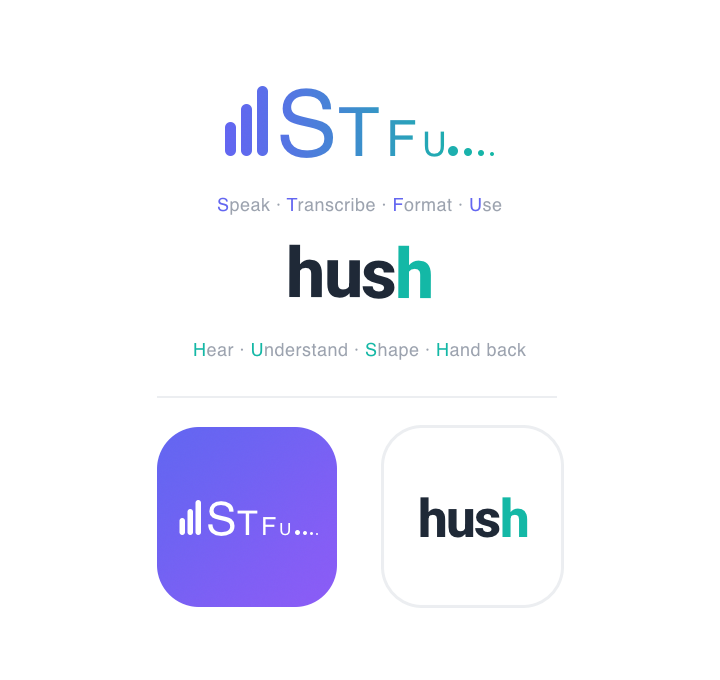

<div align="right">
  <a href="README_RU.md">🇷🇺 Русский</a> &nbsp;|&nbsp; <a href="README.md">🇬🇧 English</a> &nbsp;|&nbsp; <b>🇪🇸 Español</b>
</div>

<div align="center">



<br>

**Habla. Suelta. Listo.**

Entrada de voz con postprocesamiento mediante LLM — localmente, sin servidores, sin suscripciones.

<br>

[](https://www.apple.com/macos/)
[](https://python.org)
[](https://pyobjc.readthedocs.io)
[](LICENSE)

</div>

---

HUSH es una herramienta para quienes piensan más rápido de lo que escriben. Mantén pulsado el atajo, habla en voz alta, suéltalo — el texto ya está en la aplicación que necesitas. Opcionalmente: pásalo por un LLM y obtén una carta lista, una lista de tareas o una nota formateada. El reconocimiento de voz funciona completamente en el dispositivo mediante Apple Neural Engine — sin telemetría, sin micrófonos en la nube.

## ¿Por qué HUSH?

La idea surgió tras conocer la aplicación [Spokenly](https://spokenly.app). Demostró que la entrada de voz con postprocesamiento mediante LLM es realmente cómoda. Pero quería algo propio: sin limitaciones de pago, sin una interfaz sobrecargada, adaptado a flujos de trabajo concretos.

HUSH se creó y perfeccionó en condiciones reales — lo uso todos los días. Por eso cada detalle surgió de una necesidad real, no por cumplir un requisito. Espero que también te resulte útil.

Todo es personalizable: escenarios, proveedores, temas. Sin versiones de pago — solo código abierto.

---

## Contenido

- [Cómo funciona](#cómo-funciona)
- [Modos de funcionamiento](#modos-de-funcionamiento)
- [Atajos de teclado](#atajos-de-teclado)
- [Escenarios de postprocesamiento](#escenarios-de-postprocesamiento)
- [Editor de escenarios](#editor-de-escenarios)
- [Historial de transcripciones](#historial-de-transcripciones)
- [Proveedores LLM](#proveedores-llm)
- [Temas de color](#temas-de-color)
- [Instalación](#instalación)
- [Claves API](#claves-api)
- [Privacidad](#privacidad)
- [Arquitectura](#arquitectura)
- [Idiomas](#idiomas)
- [Apoyar el proyecto](#apoyar-el-proyecto)

---

## Cómo funciona

HUSH es una aplicación accesoria: sin icono en el Dock, solo un icono en la barra de menú. La lanzas y te olvidas de ella. Siempre está lista para recibir tu voz en cualquier aplicación.

**Bajo el capó:**

- El audio se captura mediante `sounddevice` directamente en RAM
- El reconocimiento lo realiza NVIDIA Parakeet TDT 0.6B, compilado para CoreML / Apple Neural Engine (~400 MB, incluido en la distribución)
- Si es necesario, el texto se envía a un LLM (Ollama local o en la nube: Anthropic / OpenAI / GLM)
- El resultado se inserta en la aplicación activa mediante la API de Accesibilidad — sin portapapeles, sin parpadeos

El primer arranque compila el modelo CoreML para tu chip específico. Esto tarda hasta un minuto y ocurre una sola vez. Todos los arranques posteriores son instantáneos.

---

## Modos de funcionamiento

### Modo silencioso — Right ⌥

La forma más rápida de dictar. No requiere ninguna acción adicional.

1. **Mantener pulsado** Right ⌥ → aparece un pequeño indicador de grabación flotante en el borde de la pantalla
2. **Hablar** — el indicador muestra que la grabación está en curso
3. **Soltar** → el fragmento se transcribe

Si necesitas dictar varios fragmentos:

- Mantener pulsado–soltar varias veces → los fragmentos se **acumulan**
- Cuando la pausa dura **4 segundos** — comienza el procesamiento mediante LLM
- Las barras del indicador visualizan la cuenta atrás: se vuelven verdes → luego rojas
- **Enter** durante la cuenta atrás → insertar inmediatamente sin LLM
- **Hover** durante el procesamiento → aparece un botón para interrumpir (insertar transcripción en bruto)

El indicador se puede arrastrar a cualquier lugar de la pantalla — la posición se guarda entre sesiones.

---

### Modo completo — ⇧⌥

Para tareas complejas: dictado por partes, selección de escenario, revisión del resultado antes de insertarlo.

1. **⇧⌥** → se abre una ventana grande (sin inicio inmediato de grabación)
2. **Mantener pulsado ⌥** → grabar un fragmento → **soltar** → la transcripción aparece en la ventana como un bloque separado
3. Repetir cuantas veces sea necesario — los bloques se acumulan en la ventana
4. Seleccionar el escenario deseado y pulsar su botón — el texto se enviará al LLM
5. **Shift+Enter** → insertar el resultado en la aplicación activa anterior, la ventana se cierra

Si en la configuración se ha definido un escenario «por defecto para el modo completo» (★), se aplica automáticamente al pulsar Shift+Enter — no es necesario pulsar un botón aparte.

---

### Modo expandido — doble clic en el título

Cuando se ha dictado mucho texto y se necesita leerlo con calma, editarlo o simplemente verlo cómodamente — la ventana principal se puede expandir.

- **Doble clic** en cualquier parte del título de la ventana principal → la ventana se expande hasta 640×680
- Doble clic de nuevo → vuelve al tamaño compacto

En modo expandido, los paneles auxiliares (configuración, historial, proveedores, editor) se agrupan automáticamente en un clúster 2×2 junto a la ventana:

- Arrastrar cualquier panel del clúster → **todo el clúster se mueve junto**
- **🔄** en la configuración → restablecer el clúster a la posición predeterminada
- **🎯** → mostrar / ocultar todos los paneles del clúster

---

## Atajos de teclado

| Gesto                                  | Acción                                                      |
| -------------------------------------- | ----------------------------------------------------------- |
| Mantener pulsado Right ⌥               | Iniciar grabación (modo silencioso)                         |
| Soltar Right ⌥                         | Detener grabación, transcribir                              |
| ⇧⌥ (Shift + Right Option)              | Abrir / cerrar modo completo                                |
| ⌥ en modo completo                     | Grabar el siguiente bloque                                  |
| Enter durante la cuenta atrás          | Inserción inmediata sin LLM                                 |
| Shift+Enter en modo completo           | Insertar (aplicar escenario por defecto, si está definido)  |
| ⌥ durante el procesamiento LLM         | Interrumpir LLM, insertar texto en bruto                    |
| Doble clic en el título                | Expandir / contraer la ventana principal                    |

---

## Escenarios de postprocesamiento

Los escenarios son prompts de sistema personalizables que el LLM aplica al texto transcrito. Cada escenario es un botón en la interfaz. Puedes editar los integrados y crear los tuyos propios.

La configuración se guarda en `~/.config/hush/scenarios.json`.

### Escenarios integrados

| Escenario | Qué hace |
|-----------|----------|
| **MAIN** | Formateador inteligente: determina el tipo de texto (prompt, tareas, carta, nota) y aplica el formato correspondiente; elimina muletillas y errores de dicción |
| **LIMPIEZA** | Añade puntuación, mayúsculas, comillas tipográficas («»); elimina muletillas sin cambiar el significado |
| **CARTA** | Da formato al texto como una carta formal: saludo, estructura, firma |
| **Tareas** | Convierte un flujo de ideas en una lista de tareas con casillas de verificación en formato Markdown |
| **MD** | Da formato como Markdown con encabezados, listas y bloques de código |

> Un escenario sin prompt inserta la transcripción en bruto — útil como «botón de inserción rápida».

### Indicadores de escenario

- **`modo silencioso`** — asignar este escenario como predeterminado para el modo silencioso (solo uno)
- **`por defecto ★`** — asignar este escenario como predeterminado para el modo completo (solo uno)

---

## Editor de escenarios

Abrir: ⚙ Configuración → hacer clic en cualquier escenario.

| Campo                       | Descripción                                                                      |
| --------------------------- | -------------------------------------------------------------------------------- |
| **Nombre** (RU / EN / ES)   | Hasta 6 caracteres — se muestra en el botón del escenario                        |
| **Modelo**                  | Reemplazar el LLM para este escenario concreto (vacío = auto)                    |
| **Prompt**                  | Instrucción de sistema; el texto transcrito se añade al final automáticamente    |
| **Modo silencioso**         | Asignar el escenario como predeterminado para el modo silencioso                 |
| **Por defecto ★**           | Asignar el escenario como predeterminado para el modo completo                   |

Al cambiar entre escenarios con cambios sin guardar, HUSH preguntará: **Guardar / Cancelar**.

---

## Historial de transcripciones

Las últimas **50 transcripciones** se guardan automáticamente en `~/.config/hush/history.json`.

El panel de historial (🕐) contiene tres pestañas:

| Pestaña | Contenido |
|---------|-----------|
| **Todos** | Todos los bloques en orden cronológico |
| **Sesiones** | Agrupación: varios fragmentos de la misma sesión se combinan en un registro |
| **Bloques** | Solo los fragmentos individuales |

**Qué se puede hacer con el historial:**

- Hacer clic en un elemento → añadirlo como nuevo bloque a la sesión actual del modo completo
- Casillas de verificación → selección múltiple
- Botones con selección múltiple: **Eliminar** / **Combinar** / **Añadir** / **Reemplazar**

El panel permanece abierto después de insertar — puedes seleccionar y combinar varios registros de forma secuencial.

---

## Proveedores LLM

Configurar: ⚙ → **[CLAVES]**.

| Proveedor | Tipo | Requisito |
|-----------|------|-----------|
| **Ollama** | Local | [Ollama](https://ollama.ai) instalado + modelo (`ollama pull <model>`) |
| **Anthropic** | Nube | Clave API (`sk-ant-...`) |
| **OpenAI** | Nube | Clave API (compatible con cualquier API compatible con OpenAI) |
| **GLM** | Nube | Clave API de Zhipu GLM-4 |

### Selección de modelo en el escenario

El modelo para cada escenario se selecciona en el editor de escenarios mediante dos listas desplegables:

1. **Proveedor** — seleccionar entre los configurados y disponibles (Ollama / Anthropic / OpenAI / GLM)
2. **Modelo** — la lista se rellena automáticamente con los modelos disponibles del proveedor seleccionado

Si un proveedor no está configurado o no está disponible — no aparecerá en la lista. Si no se selecciona ningún modelo, HUSH usa una estrategia automática: primero prueba Ollama, si no está disponible — Anthropic.

---

## Temas de color

8 temas integrados, se cambian en la configuración (⚙ → Tema). Todos los paneles abiertos — configuración, editor de escenarios, historial — se actualizan al instante.

| Tema | Fondo | Acento |
|------|-------|--------|
| **emerald** | Verde oscuro | Verde brillante |
| **ocean** | Azul oscuro | Azul celeste |
| **neon** | Violeta oscuro | Magenta |
| **gold** | Ámbar oscuro | Amarillo |
| **paper** | Crema | Verde oscuro |
| **sky** | Azul claro | Azul oscuro |
| **sand** | Beige cálido | Marrón |
| **arctic** | Blanco helado | Turquesa |

---

## Instalación

### Requisitos

- **macOS 13+** (Ventura o posterior)
- **Python 3.14** — `brew install python@3.14`
- **Permiso de Accesibilidad** — para la inserción automática de texto (se solicita en el primer arranque)
- **Permiso de Micrófono** — se solicita en el primer arranque

Opcional, para escenarios con LLM:
- [Ollama](https://ollama.ai) con un modelo descargado
- Claves API de Anthropic / OpenAI / GLM

### Pasos

```bash
git clone https://github.com/alexbic/hush.git
cd hush
pip3.14 install pyobjc sounddevice pynput anthropic openai
bash build_app.sh
open HUSH.app
```

En el primer arranque, HUSH automáticamente:
1. Copia `parakeet-cli` en `~/.local/bin/`
2. Coloca el modelo CoreML en `~/.local/share/hush/`
3. Compila el modelo para tu chip (ANE) — ocurre una sola vez, la caché se conserva entre actualizaciones

---

## Claves API

**Opción 1 — mediante la interfaz:** ⚙ → [CLAVES] → introducir las claves en los campos.

**Opción 2 — mediante archivo** `~/.hush_env`:

```bash
export ANTHROPIC_API_KEY="sk-ant-..."
export OPENAI_API_KEY="sk-..."
export OLLAMA_BASE_URL="http://localhost:11434"
export GLM_API_KEY="..."
```

---

## Privacidad

- Todo el reconocimiento de voz funciona **localmente** — Parakeet TDT se ejecuta en el dispositivo mediante CoreML / Apple Neural Engine
- El audio no se graba en disco ni se conserva más allá de una sesión
- Al LLM en la nube solo llega **texto** — y únicamente si tú mismo has configurado un escenario en la nube (Anthropic / OpenAI / GLM)
- Con Ollama — todo el procesamiento permanece en tu ordenador

---

## Arquitectura

HUSH está escrito en Python 3.14 con una UI nativa mediante PyObjC + AppKit. Sin Electron, sin tecnologías web — todo nativo.

```
main.py          Atajos de teclado, ciclo de vida de la sesión, inserción de texto
overlay.py       Toda la UI: modo silencioso, modo completo, historial, temas
recorder.py      Captura de audio (sounddevice)
transcriber.py   Wrapper sobre el subproceso Parakeet TDT + calentamiento CoreML
processor.py     Enrutamiento LLM (Ollama / Anthropic / OpenAI / GLM)
injector.py      Inserción de texto mediante la API de Accesibilidad
config.py        Rutas, claves API, constantes
build_app.sh     Construcción del bundle HUSH.app
```

---

## Idiomas

En todos mis proyectos — el sitio [alexbic.net](https://alexbic.net), herramientas, aplicaciones — intento trabajar en tres idiomas: **ruso, inglés y español**. Quiero que personas con distintos idiomas puedan usar estas soluciones sin barreras. HUSH no es una excepción.

La interfaz y los escenarios están traducidos a los tres idiomas. Yo mismo he probado el reconocimiento principalmente en ruso — es mi lengua materna. Parakeet TDT se anuncia como un modelo multilingüe, pero qué tal funciona con el inglés o el español en la práctica — honestamente, no lo sé.

Si trabajas en inglés o en español y quieres probarlo — me alegraría mucho recibir tu opinión. Cómo escucha Parakeet tu idioma, qué funciona, qué no, qué escenarios has creado — abre un [Issue](https://github.com/alexbic/hush/issues) o escríbeme directamente. Eso ayudará a mejorar HUSH para todos.

---

## Apoyar el proyecto

HUSH es un proyecto gratuito y de código abierto. En su desarrollo se utilizó activamente [Claude Code](https://claude.ai/code) — y no hay nada de malo en reconocerlo: los modelos de lenguaje hoy son una herramienta de desarrollo tan válida como un compilador o un editor de código. Valoramos nuestro tiempo — y valoramos el tuyo.

Si HUSH te ha resultado útil, si te ha ahorrado aunque sea unos minutos al día — agradecemos cualquier apoyo. Eso ayuda a seguir haciendo cosas interesantes.

<div align="center">

<a href="https://pay.alexbic.net/?mode=donate"></a>

**[Apoyar el proyecto](https://pay.alexbic.net/?mode=donate)**

</div>

Gracias. De verdad.

---

## Historial de versiones

### v1.1 — 25.06.2026

**Sistema de cuadrícula de paneles — reescrito desde cero**

- El reset (`[🔄]`) ahora coloca todas las ventanas como grupo centrado en pantalla. El patrón se elige automáticamente según el espacio disponible: cruz 3×3 para pantallas grandes, 3×2 para medianas (la mayoría de MacBook), 2×2 para compactas.
- Tras el reset los paneles nunca se superponen: las posiciones se calculan geométricamente antes de abrir las ventanas y el grupo se desplaza para caber en pantalla.
- Nueva regla de colocación: una celda diagonal solo se usa si al menos una celda vecina por cara ya está ocupada — las ventanas no se conectan «solo por esquina».
- Al arrastrar fuera del borde de pantalla, el panel se reordena al lado opuesto en lugar de crear una 4.ª columna horizontal fuera de pantalla.

**Coherencia de la interfaz**

- Todos los botones unificados al estilo `[MAYÚSCULAS]` con corchetes en los tres idiomas (RU/EN/ES).
- El color del botón `[ESCENARIO]` ahora depende del tema: `C_YEL` se define por tema y se actualiza al cambiar. Antes el amarillo era fijo y difícil de leer en temas claros.

**Monitoreo de proveedores**

- Los botones de escenario se ponen rojos cuando el proveedor LLM asignado no está disponible. El estado se sondea cada 30 s en hilos en segundo plano; la lista de escenarios se actualiza automáticamente en cada cambio.

---

### v1.0 — 23.06.2026

Primera versión pública. Consulta las [notas de la versión v1.0](https://github.com/alexbic/hush/releases/tag/v1.0) para todos los detalles.

---

## Licencia

[MIT](LICENSE) © 2026 Alexander Bikmukhametov
